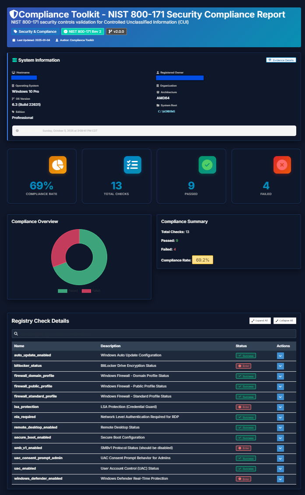

# Compliance Toolkit Documentation

**Version:** 1.1.0
**Last Updated:** 2025-01-05

Welcome to the Compliance Toolkit! This guide will help you get started with Windows registry compliance scanning.

---

## 📚 Documentation Index

### 🚀 Getting Started

1. **[Quick Start Guide](docs/user-guide/QUICKSTART.md)** - Get up and running in 5 minutes
2. **[Installation Guide](docs/user-guide/INSTALLATION.md)** - Complete installation instructions
3. **[User Guide](docs/user-guide/USER_GUIDE.md)** - Interactive mode usage

### 💻 Command Line Interface

4. **[CLI Quick Start](docs/user-guide/CLI_QUICKSTART.md)** - 5-minute CLI setup
5. **[CLI Usage Guide](docs/user-guide/CLI_USAGE.md)** - Complete CLI reference
6. **[Automation Examples](docs/user-guide/AUTOMATION.md)** - Scheduled tasks and scripts

### 📊 Reports & Compliance

7. **[Available Reports](docs/reference/REPORTS.md)** - All compliance reports
8. **[Evidence Logging](docs/reference/EVIDENCE.md)** - Audit trail documentation
9. **[Executive Reports](docs/reference/EXECUTIVE.md)** - C-level reporting features

### 🔧 Advanced Usage

10. **[Adding New Reports](docs/developer-guide/ADDING_REPORTS.md)** - Create custom reports
11. **[Template System](docs/developer-guide/TEMPLATES.md)** - HTML template customization
12. **[Configuration Reference](docs/reference/CONFIG.md)** - JSON configuration format

### 👨‍💻 Developer Resources

13. **[Architecture Overview](docs/developer-guide/ARCHITECTURE.md)** - Codebase structure
14. **[Development Guide](docs/developer-guide/DEVELOPMENT.md)** - Building and contributing
15. **[Project Status](docs/PROJECT_STATUS.md)** - Current features and roadmap


---

## 🎯 Quick Links

### For End Users:
- **First time?** → [Quick Start Guide](docs/user-guide/QUICKSTART.md)
- **Need to install?** → [Installation Guide](docs/user-guide/INSTALLATION.md)
- **Want automation?** → [CLI Quick Start](docs/user-guide/CLI_QUICKSTART.md)

### For IT Administrators:
- **Scheduled scans?** → [CLI Usage Guide](docs/user-guide/CLI_USAGE.md)
- **Need examples?** → [Automation Examples](docs/user-guide/AUTOMATION.md)
- **Compliance audit?** → [Evidence Logging](docs/reference/EVIDENCE.md)

### For Developers:
- **Custom reports?** → [Adding New Reports](docs/developer-guide/ADDING_REPORTS.md)
- **Customize UI?** → [Template System](docs/developer-guide/TEMPLATES.md)
- **Understand code?** → [Architecture Overview](docs/developer-guide/ARCHITECTURE.md)

---

## 📖 What is Compliance Toolkit?

The Compliance Toolkit is a Windows registry compliance scanner that:

- ✅ Scans Windows registry for compliance violations
- ✅ Generates professional HTML reports with charts
- ✅ Supports NIST 800-171 and FIPS 140-2 frameworks
- ✅ Creates JSON evidence logs for audits
- ✅ Runs interactively or via command line
- ✅ Perfect for scheduled compliance scans

---

## 🏃 Quick Start

### Interactive Mode
```bash
ComplianceToolkit.exe
# Select [1] Run Reports
# Choose a report
# View results in browser
```

### Command Line Mode
```bash
# List available reports
ComplianceToolkit.exe -list

# Run a single report
ComplianceToolkit.exe -report=NIST_800_171_compliance.json

# Run all reports (for scheduled tasks)
ComplianceToolkit.exe -report=all -quiet
```

---

## 📁 Documentation Structure

```
docs/
├── README.md (this file)
├── user-guide/
│   ├── QUICKSTART.md              # 5-minute getting started
│   ├── INSTALLATION.md            # Installation instructions
│   ├── USER_GUIDE.md              # Interactive mode guide
│   ├── CLI_QUICKSTART.md          # CLI quick start
│   ├── CLI_USAGE.md               # Complete CLI reference
│   └── AUTOMATION.md              # Automation examples
├── developer-guide/
│   ├── ARCHITECTURE.md            # Codebase overview
│   ├── DEVELOPMENT.md             # Build and contribute
│   ├── ADDING_REPORTS.md          # Create custom reports
│   └── TEMPLATES.md               # Template system
├── reference/
│   ├── REPORTS.md                 # Available reports
│   ├── EVIDENCE.md                # Evidence logging
│   ├── EXECUTIVE.md               # Executive reports
│   └── CONFIG.md                  # Configuration format
└── PROJECT_STATUS.md              # Project status and roadmap
```

---

## 🆘 Getting Help

### Common Issues

**"configs/reports not found"**
- Solution: Ensure `configs/reports/*.json` exists next to the executable
- See: [Installation Guide](user-guide/INSTALLATION.md#troubleshooting)

**"Access denied" errors**
- Solution: Run as Administrator
- See: [Installation Guide](user-guide/INSTALLATION.md#permissions)

**Reports not opening**
- Solution: Clear browser cache and regenerate report
- See: [User Guide](docs/user-guide/USER_GUIDE.md#troubleshooting)

### Need More Help?

- 📖 Browse the [User Guide](docs/user-guide/USER_GUIDE.md)
- 🔧 Check [CLI Usage](docs/user-guide/CLI_USAGE.md)

---

### Example Report - 
<p align="center">
  
</p>


---


## 🔄 Updates & Versions

**Current Version:** 1.1.0

**Recent Updates:**
- ✅ CLI automation support
- ✅ Scheduled task examples
- ✅ Smart path resolution
- ✅ Dark mode improvements
- ✅ Search functionality


---

*Documentation Version: 1.1*
*Last Updated: 2025-01-05*
