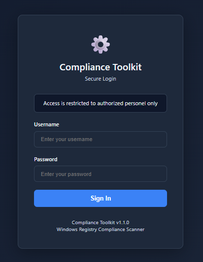
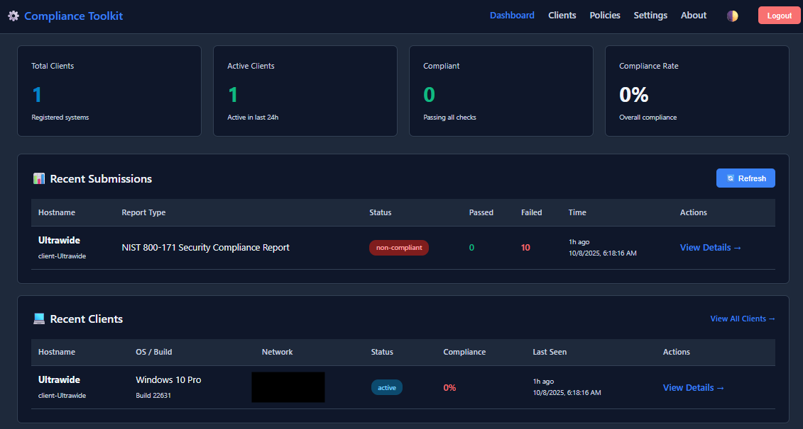
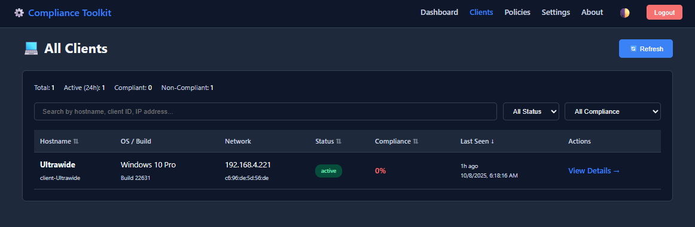
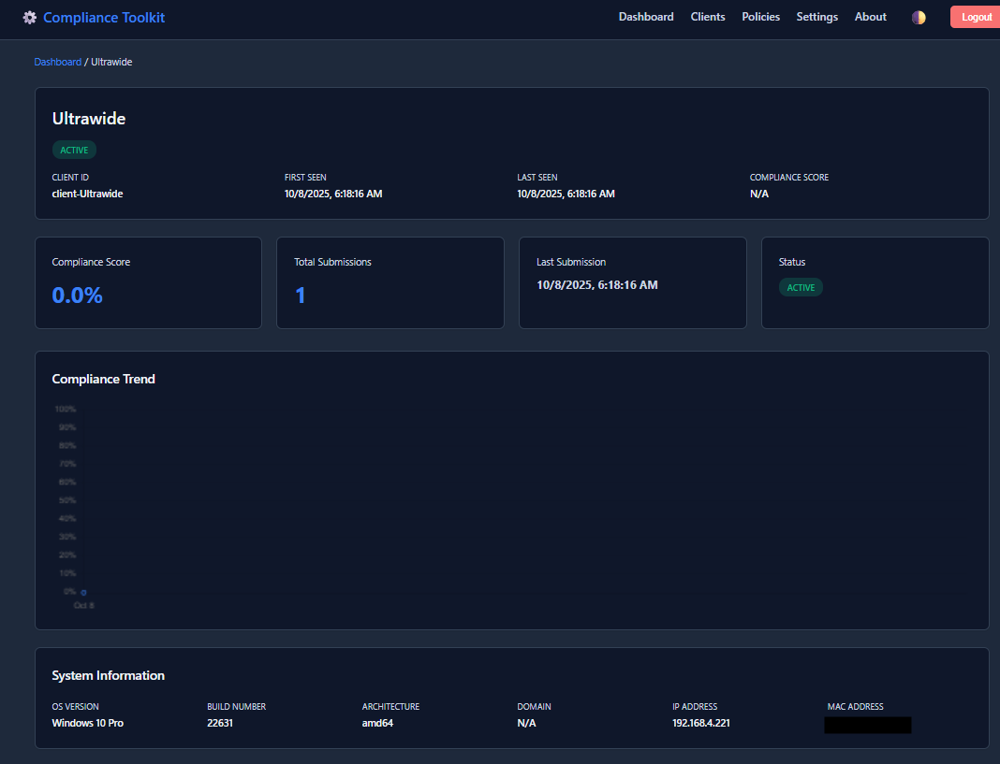
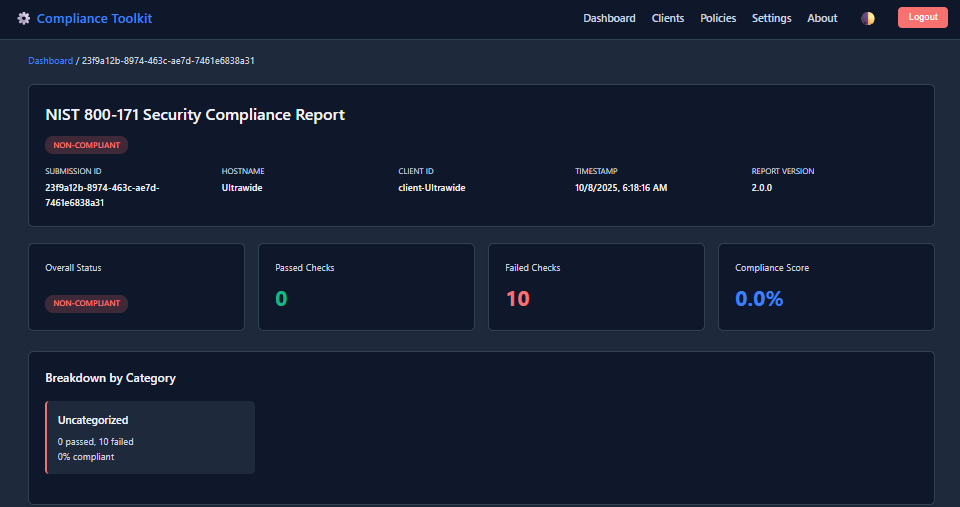
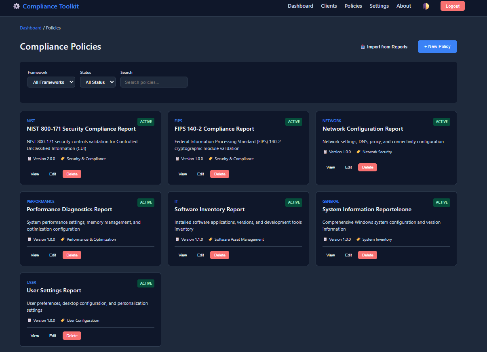
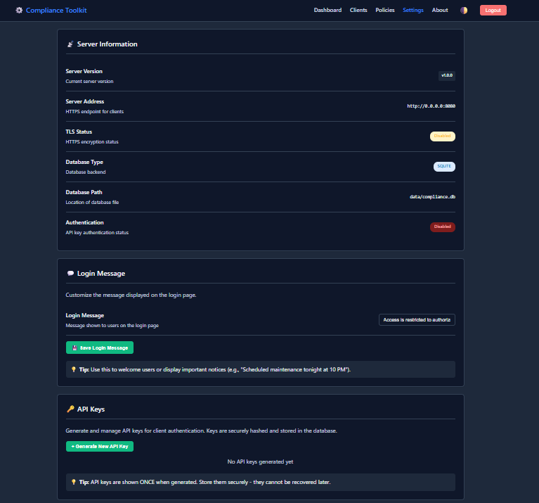
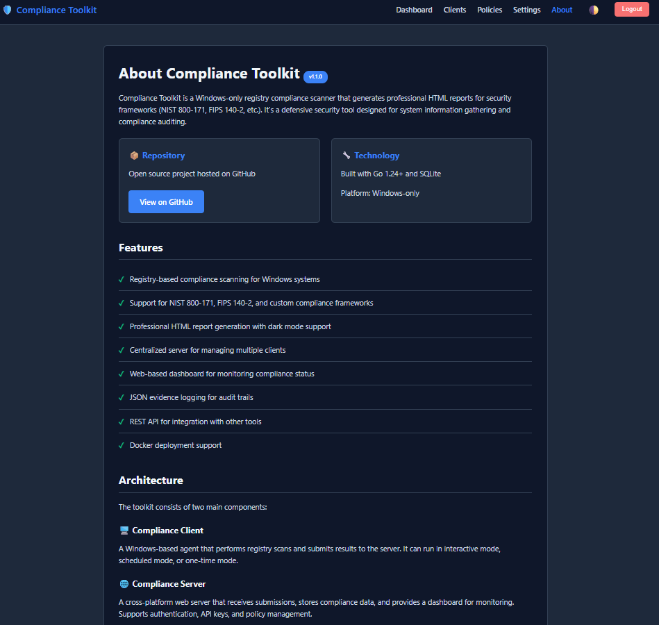

# Compliance Toolkit Documentation

**Version:** 1.1.0
**Last Updated:** 2025-10-08

Welcome to the Compliance Toolkit! A comprehensive Windows registry compliance scanner with **server/client architecture** and **web dashboard**.

## Architecture

The Compliance Toolkit now includes two deployment modes:

### Standalone Mode (Original)
Single executable for local compliance scanning and HTML report generation.

```bash
go build -ldflags="-s -w" -o ComplianceToolkit.exe ./cmd/toolkit.go
```

### Server/Client Mode (New!)
Centralized compliance monitoring with web dashboard.

**Server:**
```bash
cd cmd/compliance-server
go build -o compliance-server.exe .
./compliance-server.exe --config server.yaml
```

**Client:**
```bash
cd cmd/compliance-client
go build -o compliance-client.exe .
./compliance-client.exe --config client.yaml --once
```

**Web Dashboard:** `http://localhost:8443/dashboard`

---
### Getting Started

1. **[Quick Start Guide](docs/user-guide/QUICKSTART.md)** - Get up and running in 5 minutes
2. **[Installation Guide](docs/user-guide/INSTALLATION.md)** - Complete installation instructions
3. **[User Guide](docs/user-guide/USER_GUIDE.md)** - Interactive mode usage

### Server/Client Mode (New!)

- **[Unit Testing Guide](docs/testing/UNIT_TESTING_GUIDE.md)** - Complete testing procedures for server/client
- **[Client Detail Page](docs/project/CLIENT_DETAIL_PAGE.md)** - Client drill-down documentation
- **[Settings Page Enhancements](docs/project/SETTINGS_PAGE_ENHANCEMENTS.md)** - API key management

### Command Line Interface

4. **[CLI Quick Start](docs/user-guide/CLI_QUICKSTART.md)** - 5-minute CLI setup
5. **[CLI Usage Guide](docs/user-guide/CLI_USAGE.md)** - Complete CLI reference
6. **[Automation Examples](docs/user-guide/AUTOMATION.md)** - Scheduled tasks and scripts

### Reports & Compliance

7. **[Available Reports](docs/reference/REPORTS.md)** - All compliance reports
8. **[Evidence Logging](docs/reference/EVIDENCE.md)** - Audit trail documentation
9. **[Executive Reports](docs/reference/EXECUTIVE.md)** - C-level reporting features

### Advanced Usage

10. **[Adding New Reports](docs/developer-guide/ADDING_REPORTS.md)** - Create custom reports
11. **[Template System](docs/developer-guide/TEMPLATES.md)** - HTML template customization
12. **[Configuration Reference](docs/reference/CONFIG.md)** - JSON configuration format

### Developer Resources

13. **[Architecture Overview](docs/developer-guide/ARCHITECTURE.md)** - Codebase structure
14. **[Development Guide](docs/developer-guide/DEVELOPMENT.md)** - Building and contributing
15. **[Project Status](docs/PROJECT_STATUS.md)** - Current features and roadmap


---

## Quick Links

### For End Users:
- **First time?** → [Quick Start Guide](docs/user-guide/QUICKSTART.md)
- **Need to install?** → [Installation Guide](docs/user-guide/INSTALLATION.md)
- **Want automation?** → [CLI Quick Start](docs/user-guide/CLI_QUICKSTART.md)

### For IT Administrators:
- **Scheduled scans?** → [CLI Usage Guide](docs/user-guide/CLI_USAGE.md)
- **Need examples?** → [Automation Examples](docs/user-guide/AUTOMATION.md)
- **Compliance audit?** → [Evidence Logging](docs/reference/EVIDENCE.md)

### For Developers:
- **Custom reports?** → [Adding New Reports](docs/developer-guide/ADDING_REPORTS.md)
- **Customize UI?** → [Template System](docs/developer-guide/TEMPLATES.md)
- **Understand code?** → [Architecture Overview](docs/developer-guide/ARCHITECTURE.md)

---

## What is Compliance Toolkit?

The Compliance Toolkit is a comprehensive Windows registry compliance scanner with:

### Standalone Features
- ✅ Scans Windows registry for compliance violations
- ✅ Generates professional HTML reports with charts
- ✅ Supports NIST 800-171 and FIPS 140-2 frameworks
- ✅ Creates JSON evidence logs for audits
- ✅ Runs interactively or via command line
- ✅ Perfect for scheduled compliance scans

### Server/Client Features (New!)
- ✅ **Centralized server** with RESTful API
- ✅ **Web dashboard** for real-time monitoring
- ✅ **Client detail pages** with compliance history
- ✅ **Submission detail pages** with full check results
- ✅ **Settings management** with live API key control
- ✅ **Dark/light theme** support
- ✅ **Cookie-based authentication** (secure, no exposed tokens)
- ✅ **Postgres database** 
- ✅ **Auto-refresh dashboard** (30-second intervals)
- ✅ **Export functionality** (JSON downloads)
- ✅ **Compliance trend charts** (Chart.js visualization)

---

## Quick Start

### Docker Deployment (Recommended)

The fastest way to get started is using Docker:

```bash
# Clone the repository
git clone https://github.com/MrBrooks-code/compliance-toolkit.git
cd compliance-toolkit

# Build and run with Docker Compose
docker-compose up -d

# Access the web dashboard
http://localhost:8080/login
```

**Default credentials:**
- Username: `admin`
- Password: `admin123`

**What you get:**
- ✅ Web dashboard at `http://localhost:8080`
- ✅ RESTful API for compliance submissions
- ✅ SQLite database with persistent storage
- ✅ Automatic container restart on failure

**Useful commands:**
```bash
# View logs
docker-compose logs -f

# Stop the server
docker-compose down

# Rebuild after changes
docker-compose up --build -d
```

---

### 🖥️ Standalone Mode (Local Scanning)

**Interactive Mode:**
```bash
ComplianceToolkit.exe
# Select [1] Run Reports
# Choose a report
# View results in browser
```

**Command Line Mode:**
```bash
# List available reports
ComplianceToolkit.exe -list

# Run a single report
ComplianceToolkit.exe -report=NIST_800_171_compliance.json

# Run all reports (for scheduled tasks)
ComplianceToolkit.exe -report=all -quiet
```

---

### Server/Client Mode (Manual Deployment)

**1. Start Server:**
```bash
cd cmd/compliance-server
./compliance-server.exe --config server.yaml
```

**2. Run Client (send compliance data):**
```bash
./compliance-client.exe --config client.yaml --once
```

**3. Access Web Dashboard:**
```
http://localhost:8443/dashboard
```

---

## Documentation Structure

```
docs/
├── README.md (this file)
├── user-guide/
│   ├── QUICKSTART.md              # 5-minute getting started
│   ├── INSTALLATION.md            # Installation instructions
│   ├── USER_GUIDE.md              # Interactive mode guide
│   ├── CLI_QUICKSTART.md          # CLI quick start
│   ├── CLI_USAGE.md               # Complete CLI reference
│   └── AUTOMATION.md              # Automation examples
├── developer-guide/
│   ├── ARCHITECTURE.md            # Codebase overview
│   ├── DEVELOPMENT.md             # Build and contribute
│   ├── ADDING_REPORTS.md          # Create custom reports
│   └── TEMPLATES.md               # Template system
├── reference/
│   ├── REPORTS.md                 # Available reports
│   ├── EVIDENCE.md                # Evidence logging
│   ├── EXECUTIVE.md               # Executive reports
│   └── CONFIG.md                  # Configuration format
└── PROJECT_STATUS.md              # Project status and roadmap
```

---

## Getting Help

### Common Issues

**"configs/reports not found"**
- Solution: Ensure `configs/reports/*.json` exists next to the executable
- See: [Installation Guide](user-guide/INSTALLATION.md#troubleshooting)

**"Access denied" errors**
- Solution: Run as Administrator
- See: [Installation Guide](user-guide/INSTALLATION.md#permissions)

**Reports not opening**
- Solution: Clear browser cache and regenerate report
- See: [User Guide](docs/user-guide/USER_GUIDE.md#troubleshooting)

### Need More Help?

- 📖 Browse the [User Guide](docs/user-guide/USER_GUIDE.md)
- 🔧 Check [CLI Usage](docs/user-guide/CLI_USAGE.md)

---

## Updates & Versions

**Current Version:** 1.1.0

**Recent Updates (Phase 3.2 - Full Web UI):**
- ✅ **Server/Client Architecture** - Centralized compliance monitoring
- ✅ **Web Dashboard** - Real-time stats with recent submissions and clients
- ✅ **Clients Page** - Full client list with search, filtering, sorting, and pagination
- ✅ **Client Detail Page** - Complete client history with compliance trend charts
- ✅ **Submission Detail Page** - Full compliance check details with evidence
- ✅ **Policies Page** - Import and manage compliance policies
- ✅ **Settings Page** - User management, API keys, server configuration
- ✅ **About Page** - Project information and GitHub repository link
- ✅ **Cookie-based Authentication** - Secure token management
- ✅ **Dark/Light Theme** - System-wide theme support with smooth transitions
- ✅ **Docker Support** - One-command deployment with Docker Compose
- ✅ **Export Functionality** - JSON downloads for all data
- ✅ **Auto-refresh Dashboard** - 30-second update intervals

**Previous Updates:**
- ✅ CLI automation support
- ✅ Scheduled task examples
- ✅ Smart path resolution
- ✅ Dark mode improvements
- ✅ Search functionality

## Roadmap

**Completed (Phase 3.1):**
- ✅ Client Detail Page (#2)
- ✅ Submission Detail Page (#1)
- ✅ Settings Page (#4)

**Upcoming (Phase 3.2):**
- 🔜 Login/Authentication Page (#3)
- 🔜 Reports & Analytics (#4)
- 🔜 Alerts & Notifications (#6)

See [Future Enhancements](docs/project/FUTURE_ENHANCEMENTS.md) for complete roadmap.

---

## Interface

### Login Page
<p align="center">
  
</p>
<p align="center">
  <em>Secure authentication with customizable login banner and theme support.</em>
</p>

---

### Dashboard
<p align="center">
  
</p>
<p align="center">
  <em>Real-time monitoring with compliance stats, recent submissions, and recent clients overview.</em>
</p>

---

### Clients Page
<p align="center">
  
</p>
<p align="center">
  <em>Full client list with advanced search, filtering by status/compliance, sortable columns, and pagination.</em>
</p>

---

### Client Detail Page
<p align="center">
  
</p>
<p align="center">
  <em>Complete client history with system information, compliance trend chart, and detailed submission history.</em>
</p>

---

### Submission Detail Page
<p align="center">
  
</p>
<p align="center">
  <em>Full compliance check results with passed/failed status, registry paths, and evidence records.</em>
</p>

---

### Policies Page
<p align="center">
  
</p>
<p align="center">
  <em>Import and manage compliance policies with search and filtering capabilities.</em>
</p>

---

### Settings Page
<p align="center">
  
</p>
<p align="center">
  <em>Manage users, API keys, server configuration, and customize login messages.</em>
</p>

---

### About Page
<p align="center">
  
</p>
<p align="center">
  <em>Project information, GitHub repository link, and documentation resources.</em>
</p>

---

*Documentation Version: 1.2*
*Last Updated: 2025-10-08*
